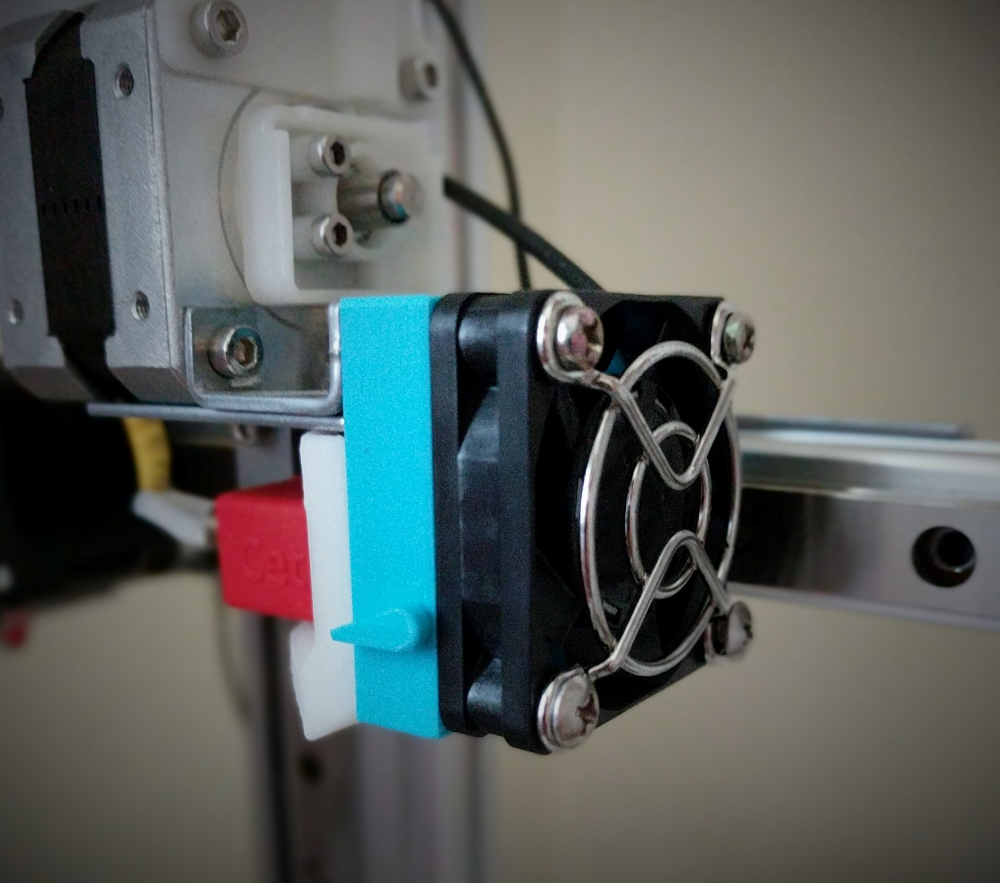

# Fan Duct

Allows you to stop the air flow to the part being printed. This is useful when printing with special filaments. These files were originally created by **[Jena67](http://www.thingiverse.com/thing:2181653
)** on [Thingiverse](http://www.thingiverse.com/thing:2181653
).

## How to print:

* Use a filament that can withstand high temperatures
* Use rafts and supports 

## Materials Needed:

* M3x25 Screw - 2x
* M3x30 Screw - 2x

## Putting it together

*  Place between the fan and the original fan duct

